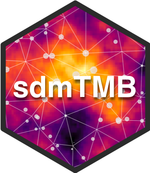
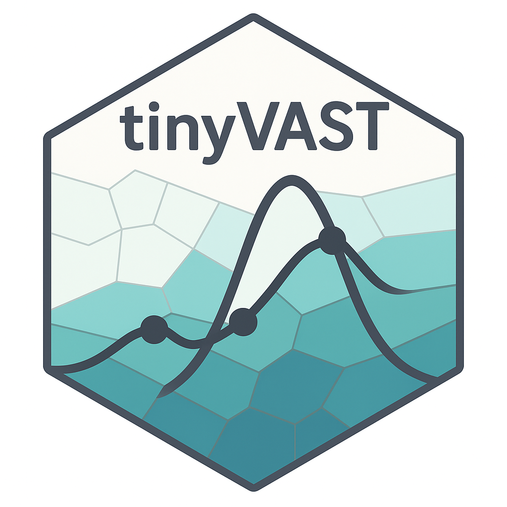

{fig-alt="Course Hex Logo" style="float:right;padding: 0 0 0 10px;" width="153"}

{fig-alt="Course Hex Logo" style="float:right;padding: 0 0 0 10px;" width="173"}

------------------------------------------------------------------------

[📆  May 4-8, 2026]{.code}\
[⏰  08:30--16:00 CDT]{.code}\
[🏨  ]{.code}Harry Hachey Conference Center, SABS \

------------------------------------------------------------------------

# Course Overview

This interactive workshop empowers fisheries scientists and analysts to master **spatiotemporal index standardization** using the `VAST` and `sdmTMB` R packages. 

Focusing on practical applications for **Western Atlantic Bluefin Tuna (ABFT)**, participants will gain both theoretical understanding and robust R skills to fit, interpret, and compare modern Generalized Linear Mixed Effects Models (GLMMs).

We demystify key concepts in index standardization—how to isolate true abundance trends amid vessel, gear, year, and spatial effects—before exploring spatial and spatiotemporal modeling using **Gaussian Random Fields (GRF)**, **SPDEs**, and **mesh-based approaches**.

Whether new to VAST or sdmTMB (or TinyVAST a more flexible tools), or looking to refine advanced workflows, you will leave with practical, reproducible R code and conceptual clarity ready to be applied to your own research.

## Learning Objectives

Through guided modules, you will learn to:

1. **Prepare** complex fisheries data for spatiotemporal analysis.
2. **Configure** models in both `sdmTMB` and `VAST` frameworks.
3. **Interpret** spatial and spatiotemporal random effects.
4. **Diagnose** model fit quality using DHARMa and other modern tools.
5. **Hands-on Application: Apply** the mastered workflows directly to your own research datasets.

# Is this course for me?

This course is designed for fisheries biologists, ecologists, and quantitative analysts who:

- [x] Want effective strategies for robust index standardization.
- [x] Aim to model spatial autocorrelation and spatiotemporal structure.
- [x] Wish to compare and visualize results across different modeling frameworks.

# Instructor

{fig-alt="Headshot of the course instructor Sosthene AKIA" style="float:right;padding: 0 0 5px 10px;" width="184"}

**Dr Sosthene AKIA** Research Scientist, Department of Fisheries and Oceans Canada (DFO). With expertise in spatiotemporal and hierarchical modeling in fisheries science, Sosthene specializes in the use of cutting-edge R packages (VAST, sdmTMB, TinyVAST) for unbiased index standardization and model-based survey analysis. With years of experience consulting for large-scale monitoring programs and contributing to Atlantic Bluefin Tuna science, Akia brings a unique blend of practical skills and theoretical insight for a modern fisheries science audience.
